# Scraps2Snacks Page Screenshot Documentation

Each page section explains why the page exists, who can access it, what the user is expected to do, the important interface areas, and what Playwright detected on the screen during capture.

The root route `/` is a redirect route: guests go to `/login`, while signed-in users are routed to the appropriate app area.

## Previous System Updates

### Secure Account Access and Recovery

- Status: Implemented
- Related screenshots: [Login](./screenshots/01-login.png), [Register](./screenshots/02-register.png), [Reset Password](./screenshots/03-reset-password.png), [Account](./screenshots/11-account.png)
- Update summary: The system supports guest registration, returning-user login, password recovery, and authenticated account management.
- Discussion: This update established the user identity foundation. It separates guest-only routes from authenticated routes, gives users a recovery path when they lose access, and places account-level settings in one controlled area.
- Documentation notes: The screenshots show the full access journey: sign in, create account, recover password, and manage account settings after login.

### Paid Subscription and Checkout Flow

- Status: Implemented
- Related screenshots: [Subscription](./screenshots/04-subscription.png), [Payment Success](./screenshots/05-payment-success.png), [Payment Cancel](./screenshots/06-payment-cancel.png)
- Update summary: The system includes paid plan selection, PayMongo checkout handling, and clear return screens for successful, pending, or canceled payment attempts.
- Discussion: This update protects premium app areas behind subscription status while giving users a visible path to recover from checkout cancellation or delayed payment confirmation.
- Documentation notes: The screenshots document plan selection, pending payment verification, and checkout cancellation recovery.

### Personalized Onboarding

- Status: Implemented
- Related screenshots: [Onboarding](./screenshots/07-onboarding.png)
- Update summary: The onboarding flow collects diet preferences and allergy restrictions before users enter the pantry workflow.
- Discussion: This update makes recipe and ingredient experiences more relevant because the system can apply preferences before generating suggestions or validating scanned food items.
- Documentation notes: The screenshot captures the preference chips and the completion action used during first-run setup.

### Pantry Management and Magic Scan

- Status: Implemented
- Related screenshots: [Pantry](./screenshots/08-pantry.png), [Magic Scan](./screenshots/09-magic-scan.png)
- Update summary: Users can manage household pantry items manually and start an AI-assisted image scanning workflow for ingredient capture.
- Discussion: This update forms the core food-waste reduction workflow. The pantry keeps ingredient records organized, while Magic Scan reduces manual entry by allowing users to upload or capture food images.
- Documentation notes: The screenshots show both the populated pantry workspace and the image upload entry point for AI scanning.

### Cookbook and Recipe Assistance

- Status: Implemented
- Related screenshots: [Cookbook](./screenshots/10-cookbook.png)
- Update summary: The system stores saved recipes and provides a cookbook area for reviewing, editing, deleting, and getting recipe help.
- Discussion: This update connects pantry ingredients to reusable cooking outcomes. Users can preserve generated recipes, review instructions, and keep practical meal ideas available after the first generation.
- Documentation notes: The screenshot displays a populated cookbook state so saved recipes and actions are visible.

### Admin Management Console

- Status: Implemented
- Related screenshots: [Admin Dashboard](./screenshots/12-admin-dashboard.png), [Admin Users](./screenshots/13-admin-users.png), [Admin Plans](./screenshots/14-admin-plans.png), [Admin Pantry](./screenshots/15-admin-pantry.png), [Admin Recipes](./screenshots/16-admin-recipes.png)
- Update summary: Admins have a dedicated console for system metrics, user records, subscription plans, pantry data, and recipes.
- Discussion: This update gives operators a single place to review activity and maintain system data. It supports both monitoring and direct management of records used by the public app.
- Documentation notes: The screenshots cover every admin sidebar section so the documentation includes the complete admin surface.

### Supabase Data and Payment Backend Hardening

- Status: Implemented
- Related screenshots: [Subscription](./screenshots/04-subscription.png), [Payment Success](./screenshots/05-payment-success.png), [Admin Users](./screenshots/13-admin-users.png)
- Update summary: Database migrations and Edge Functions support checkout sessions, subscription records, personal household setup, and safer admin user deletion flows.
- Discussion: This update strengthens the data layer behind the visible screens. It keeps subscriptions, households, checkout attempts, and admin maintenance behavior aligned with the frontend routes.
- Documentation notes: The related screenshots show the user-facing and admin-facing areas most directly supported by the backend changes.

## Latest System Update

- Date added: May 9, 2026
- Update title: Visual System Documentation and Update Presentation
- Status: Added today
- Feature added today: A complete presentation-ready documentation layer that explains previous updates, identifies the latest update, and pairs system screenshots with clear discussion.
- Purpose: This update turns the page screenshot bundle into a structured system presentation. It is designed for reviewers who need to understand what the system already has, what was added most recently, and how each screenshot proves or explains the feature.
- Related screenshots: [Admin Dashboard](./screenshots/12-admin-dashboard.png), [Admin Recipes](./screenshots/16-admin-recipes.png)

### What Was Added Today

  - Added a Previous System Updates section with explanations for completed system features.
  - Added a Latest System Update section dated May 9, 2026.
  - Added a Screenshot and Documentation Coverage section so every screenshot has a labeled explanation.
  - Kept the detailed page-by-page documentation with route, access, user flow, detected page structure, notes, and full screenshots.

### Latest Update Discussion

The newest update is documentation-focused rather than a new business workflow. It improves the system presentation by connecting screenshots to feature history, current functionality, and review requirements.

### Latest Update Screenshot Discussion

- Admin Dashboard: Admin landing section for high-level metrics and operational shortcuts. This is the default admin section shown when an admin opens the /admin route.
- Admin Recipes: Admin recipe-maintenance section reached from the Recipes item in the sidebar. This section documents the final sidebar destination that was missing from the earlier admin capture.

## Screenshots and Documentation Coverage

The table below labels every screenshot included in this documentation bundle and explains what each image demonstrates. Full-size screenshots and page-level discussions appear in the detailed sections after the page index.

| # | Screenshot | What It Shows | Discussion |
|---|---|---|---|
| 1 | [Login](./screenshots/01-login.png) | Public sign-in screen for returning users. | This page is the main entry point for existing users. Error and notice alerts appear above the form after login or password-reset actions. |
| 2 | [Register](./screenshots/02-register.png) | Public account creation and paid plan selection flow. | The visual documentation uses seeded plan data so the page can be captured even without a live Supabase subscription_plans table. |
| 3 | [Reset Password](./screenshots/03-reset-password.png) | Password recovery screen shown from a valid recovery link. | The screenshot is captured with recovery parameters so the form is enabled instead of showing an expired-link state. |
| 4 | [Subscription](./screenshots/04-subscription.png) | Plan selection page for authenticated users without active access. | This capture shows the pre-subscription state because it is the most important gated access screen. |
| 5 | [Payment Success](./screenshots/05-payment-success.png) | PayMongo return page while payment confirmation is pending. | The screenshot intentionally shows the pending state because it is visible before automatic verification or redirect completes. |
| 6 | [Payment Cancel](./screenshots/06-payment-cancel.png) | Checkout cancellation page with retry and plan navigation. | This screen prevents users from feeling stuck after leaving the external payment provider. |
| 7 | [Onboarding](./screenshots/07-onboarding.png) | Diet and allergy preference setup before entering the app. | The app reuses this route later as a preferences editor, but this capture shows the first-run onboarding version. |
| 8 | [Pantry](./screenshots/08-pantry.png) | Household pantry management and recipe generation workspace. | This is the core productivity page for reducing food waste. Mock pantry data includes varied expiration dates to show table badges and actions. |
| 9 | [Magic Scan](./screenshots/09-magic-scan.png) | Image upload and camera entry point for ingredient scanning. | The screenshot captures the idle upload state. Detection results appear after a user chooses an image. |
| 10 | [Cookbook](./screenshots/10-cookbook.png) | Saved AI recipes and cookbook management. | Mock saved recipes are included so the documentation shows the populated cookbook state instead of the empty state. |
| 11 | [Account](./screenshots/11-account.png) | Profile, password, subscription, preferences, and sign-out controls. | This page acts as the navigation hub for account-level settings and billing/preferences management. |
| 12 | [Admin Dashboard](./screenshots/12-admin-dashboard.png) | Admin landing section for high-level metrics and operational shortcuts. | This is the default admin section shown when an admin opens the /admin route. |
| 13 | [Admin Users](./screenshots/13-admin-users.png) | Admin user-management section reached from the Users item in the sidebar. | This section is not a separate React Router page; it is a sidebar-driven tab inside Admin, so the documentation labels it as an admin section. |
| 14 | [Admin Plans](./screenshots/14-admin-plans.png) | Admin plan-management section reached from the Plans item in the sidebar. | These plan records feed the public registration and subscription pages, so this section is part of the app configuration surface. |
| 15 | [Admin Pantry](./screenshots/15-admin-pantry.png) | Admin pantry-inspection section reached from the Pantry item in the sidebar. | This admin section supports operational review of household pantry data and is separate from the user-facing Pantry page. |
| 16 | [Admin Recipes](./screenshots/16-admin-recipes.png) | Admin recipe-maintenance section reached from the Recipes item in the sidebar. | This section documents the final sidebar destination that was missing from the earlier admin capture. |

## Presentation Requirements Checklist

| Requirement | Documentation Evidence |
|---|---|
| Previous System Updates | Covered through grouped update summaries for authentication, checkout, onboarding, pantry, scanning, cookbook, admin, and backend hardening. |
| Latest System Update | Documented as the Visual System Documentation and Update Presentation update added on May 9, 2026. |
| Screenshots and Documentation | Every captured page screenshot is included in the detailed page sections and summarized in the coverage table. |
| Clear Formatting | The document uses labeled headings, tables, route metadata, user-flow notes, screenshot discussions, and export-ready HTML, DOC, and PDF output. |

## Page Index

| # | Page | Route | Access / Routing | Screenshot |
|---|---|---|---|---|
| 1 | Login | `/login` | Guest-only route. Authenticated users are redirected to their default app destination. | [Screenshot](./screenshots/01-login.png) |
| 2 | Register | `/register` | Guest-only route. Authenticated users are redirected to their app destination. | [Screenshot](./screenshots/02-register.png) |
| 3 | Reset Password | `/reset-password` | Recovery-link route. The real app requires a Supabase password recovery session. | [Screenshot](./screenshots/03-reset-password.png) |
| 4 | Subscription | `/subscription` | Authenticated route. Users without an active subscription land here before onboarding or app access. | [Screenshot](./screenshots/04-subscription.png) |
| 5 | Payment Success | `/payment/success` | Authenticated payment-return route. It expects a checkout attempt reference in the URL. | [Screenshot](./screenshots/05-payment-success.png) |
| 6 | Payment Cancel | `/payment/cancel` | Authenticated payment-return route. It expects a checkout attempt or session reference when available. | [Screenshot](./screenshots/06-payment-cancel.png) |
| 7 | Onboarding | `/onboarding` | Authenticated and subscribed route. New users see this before the pantry; onboarded users can revisit it from Account. | [Screenshot](./screenshots/07-onboarding.png) |
| 8 | Pantry | `/pantry` | Authenticated, subscribed, and onboarded route. Regular users land here after completing setup. | [Screenshot](./screenshots/08-pantry.png) |
| 9 | Magic Scan | `/scan` | Authenticated, subscribed, onboarded route. Requires a household in the real app. | [Screenshot](./screenshots/09-magic-scan.png) |
| 10 | Cookbook | `/cookbook` | Authenticated, subscribed, onboarded route. | [Screenshot](./screenshots/10-cookbook.png) |
| 11 | Account | `/account` | Authenticated, subscribed, onboarded route. | [Screenshot](./screenshots/11-account.png) |
| 12 | Admin Dashboard | `/admin - Dashboard` | Admin-only route. Non-admin users are redirected away from this page. | [Screenshot](./screenshots/12-admin-dashboard.png) |
| 13 | Admin Users | `/admin - Users section` | Admin-only section inside the /admin route. | [Screenshot](./screenshots/13-admin-users.png) |
| 14 | Admin Plans | `/admin - Plans section` | Admin-only section inside the /admin route. | [Screenshot](./screenshots/14-admin-plans.png) |
| 15 | Admin Pantry | `/admin - Pantry section` | Admin-only section inside the /admin route. | [Screenshot](./screenshots/15-admin-pantry.png) |
| 16 | Admin Recipes | `/admin - Recipes section` | Admin-only section inside the /admin route. | [Screenshot](./screenshots/16-admin-recipes.png) |

## 1. Login

- Route: `/login`
- Captured URL: `/login?visualRole=guest`
- Purpose: Public sign-in screen for returning users.
- Access and routing: Guest-only route. Authenticated users are redirected to their default app destination.

### User Flow

A returning user enters an email and password, optionally uses the remember-me checkbox, and submits the form to start a Supabase password login. The forgot-password action opens the reset request flow.

### Main Screen Areas

  - Split-screen authentication layout with the login form on the left and a branded food image panel on the right.
  - Email and password fields, password visibility toggle, remember-me checkbox, forgot-password action, and primary login button.
  - Theme toggle is available in the top-left corner for light/dark mode switching.

### Detected Page Structure

- Key headings visible in the screenshot: `Log in to your account`, `Welcome Back, Chef!`
- Visible buttons/actions detected by Playwright: `Forgot password?`, `Log in`
- Inputs and selects detected by Playwright: `Email`, `Enter your password`, `remember`

### Documentation Notes

This page is the main entry point for existing users. Error and notice alerts appear above the form after login or password-reset actions.

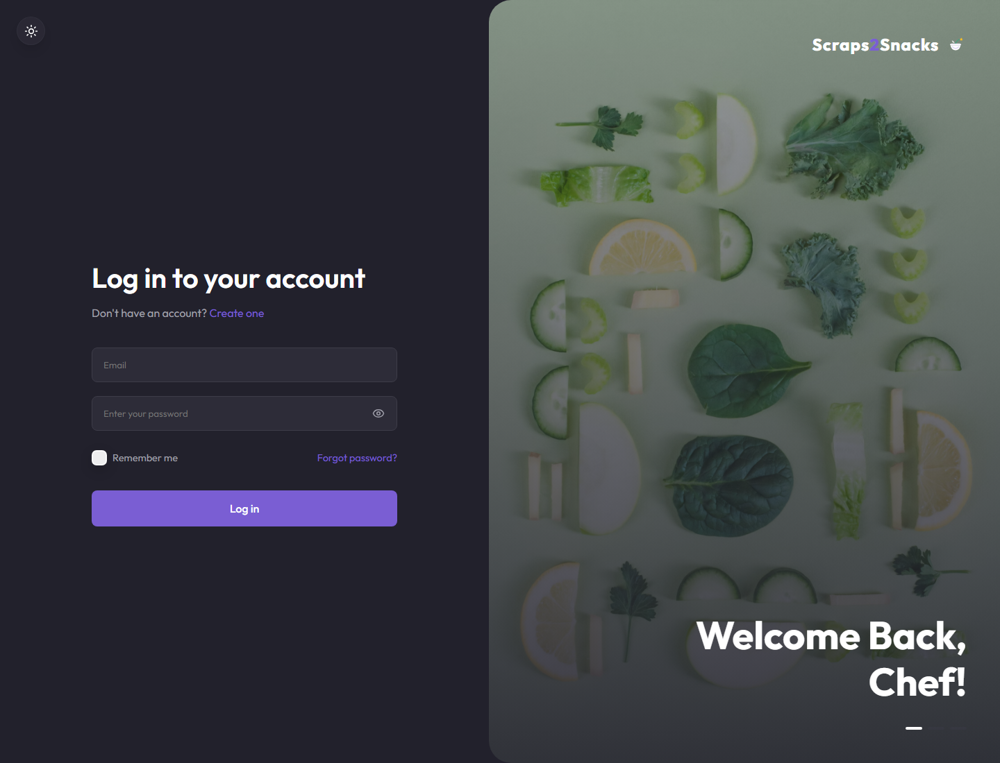

## 2. Register

- Route: `/register`
- Captured URL: `/register?visualRole=guest`
- Purpose: Public account creation and paid plan selection flow.
- Access and routing: Guest-only route. Authenticated users are redirected to their app destination.

### User Flow

A new user enters name, email, password, confirms the password, selects a paid subscription plan, accepts the terms, and continues to PayMongo checkout.

### Main Screen Areas

  - Brand image panel introduces the zero-waste cooking theme.
  - Account fields collect first name, last name, email, password, and password confirmation.
  - Plan cards show available paid plans with billing frequency and price.
  - Terms and Conditions opens an in-page dialog before account creation.

### Detected Page Structure

- Key headings visible in the screenshot: `Savor the Flavor, Stop the Waste`, `Create an account`
- Visible buttons/actions detected by Playwright: `Snack Starter Weekly access for small households testing meal planning. Billed weekly ₱...`, `Kitchen Saver Full pantry tracking, AI recipes, and Magic Scan for a month. Billed mont...`, `Zero-Waste Pro Annual access for frequent cooks and larger households. Billed annually ...`, `Terms & Conditions`, `Create account and pay`
- Inputs and selects detected by Playwright: `First name`, `Last name`, `Email`, `Enter your password`, `Confirm your password`, `terms`

### Documentation Notes

The visual documentation uses seeded plan data so the page can be captured even without a live Supabase subscription_plans table.

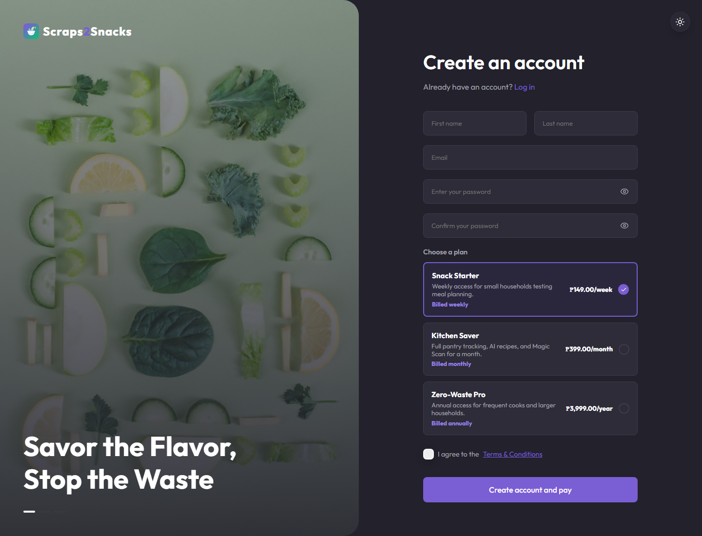

## 3. Reset Password

- Route: `/reset-password`
- Captured URL: `/reset-password`
- Purpose: Password recovery screen shown from a valid recovery link.
- Access and routing: Recovery-link route. The real app requires a Supabase password recovery session.

### User Flow

A user arriving from a recovery email enters a new password, confirms it, and submits the update. After success, the app signs the user out and sends them back to login.

### Main Screen Areas

  - Compact centered card keeps the recovery task focused.
  - New password and confirmation fields enforce a minimum password length.
  - Alert areas communicate invalid links, mismatch errors, or successful password updates.

### Detected Page Structure

- Key headings visible in the screenshot: `Reset password`
- Visible buttons/actions detected by Playwright: `Update password`
- Inputs and selects detected by Playwright: `New password`, `Confirm new password`

### Documentation Notes

The screenshot is captured with recovery parameters so the form is enabled instead of showing an expired-link state.

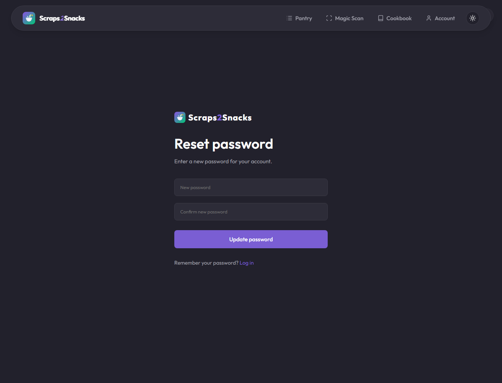

## 4. Subscription

- Route: `/subscription`
- Captured URL: `/subscription?visualRole=user`
- Purpose: Plan selection page for authenticated users without active access.
- Access and routing: Authenticated route. Users without an active subscription land here before onboarding or app access.

### User Flow

The user chooses a plan, reviews the price and billing period, then continues to PayMongo checkout. Active subscribers see a plan-management version of this screen.

### Main Screen Areas

  - Split-screen plan selection layout mirrors the auth pages for a consistent purchase flow.
  - Plan options highlight the selected plan and show price, description, and billing cadence.
  - Continue to Payment starts the PayMongo checkout creation flow.

### Detected Page Structure

- Key headings visible in the screenshot: `Unlock Culinary Excellence`, `Choose Your Plan`, `Snack Starter`, `Kitchen Saver`, `Zero-Waste Pro`
- Visible buttons/actions detected by Playwright: `Continue to Payment`
- Inputs and selects detected by Playwright: None detected.

### Documentation Notes

This capture shows the pre-subscription state because it is the most important gated access screen.

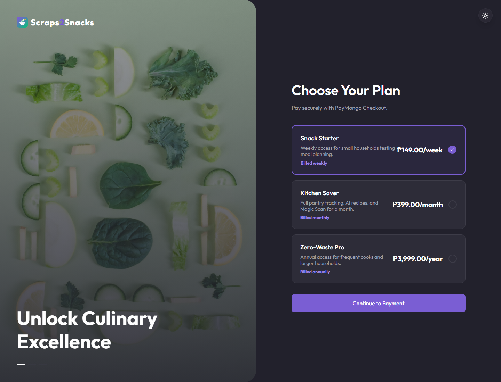

## 5. Payment Success

- Route: `/payment/success`
- Captured URL: `/payment/success?attempt_id=mock-pending&visualRole=user`
- Purpose: PayMongo return page while payment confirmation is pending.
- Access and routing: Authenticated payment-return route. It expects a checkout attempt reference in the URL.

### User Flow

After PayMongo returns the user to the app, this page checks the checkout session. If payment is confirmed, it refreshes the subscription and redirects to onboarding or account.

### Main Screen Areas

  - Status card explains whether the app is still waiting for PayMongo confirmation.
  - Plan details appear when the payment attempt is available.
  - Check Again lets users manually retry status verification.

### Detected Page Structure

- Key headings visible in the screenshot: `Payment pending`
- Visible buttons/actions detected by Playwright: `Check Again`
- Inputs and selects detected by Playwright: None detected.

### Documentation Notes

The screenshot intentionally shows the pending state because it is visible before automatic verification or redirect completes.

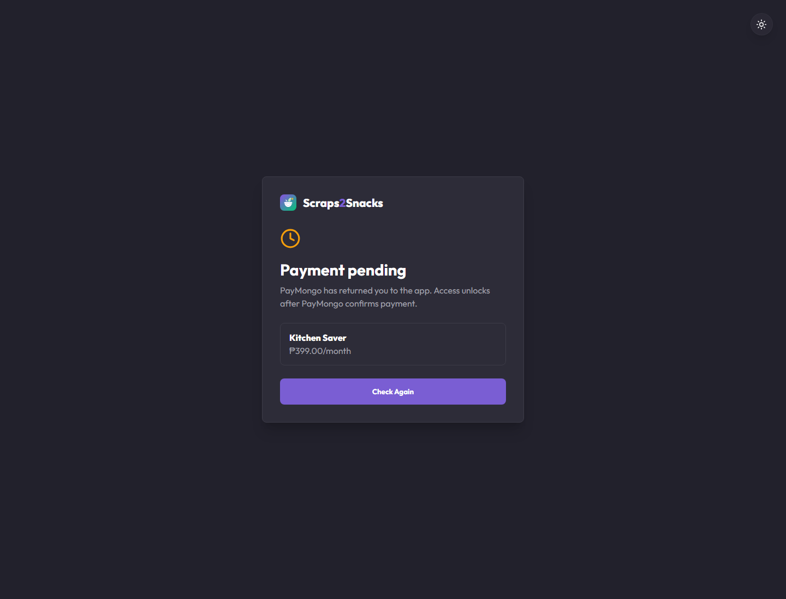

## 6. Payment Cancel

- Route: `/payment/cancel`
- Captured URL: `/payment/cancel?attempt_id=mock-canceled&visualRole=user`
- Purpose: Checkout cancellation page with retry and plan navigation.
- Access and routing: Authenticated payment-return route. It expects a checkout attempt or session reference when available.

### User Flow

A user who exits PayMongo without completing payment can return to plan selection or retry checkout for the same plan.

### Main Screen Areas

  - Status card explains that the account exists but access remains locked until payment succeeds.
  - Plan details provide context for the canceled checkout.
  - Plans and Retry buttons give clear recovery paths.

### Detected Page Structure

- Key headings visible in the screenshot: `Checkout canceled`
- Visible buttons/actions detected by Playwright: `Plans`, `Retry`
- Inputs and selects detected by Playwright: None detected.

### Documentation Notes

This screen prevents users from feeling stuck after leaving the external payment provider.

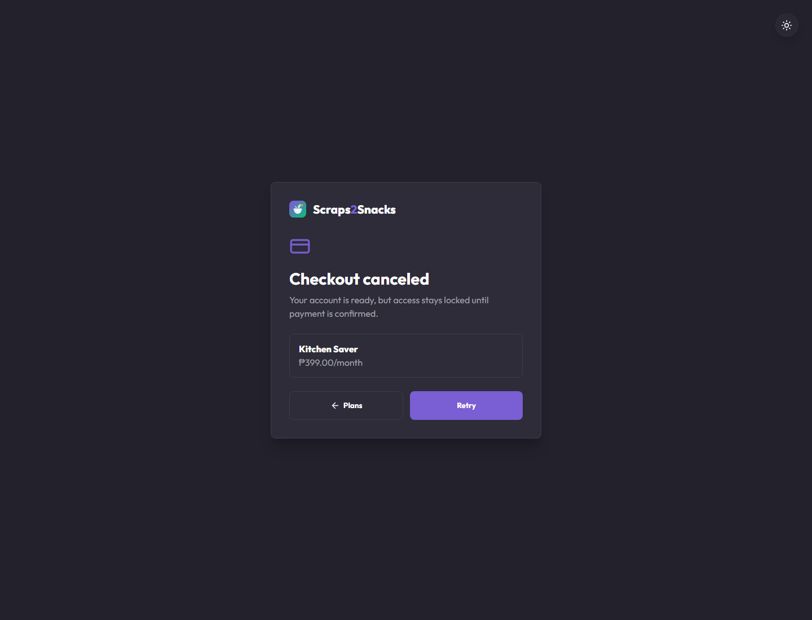

## 7. Onboarding

- Route: `/onboarding`
- Captured URL: `/onboarding?visualRole=user`
- Purpose: Diet and allergy preference setup before entering the app.
- Access and routing: Authenticated and subscribed route. New users see this before the pantry; onboarded users can revisit it from Account.

### User Flow

The user selects diet preferences and allergies, then completes onboarding. These preferences personalize ingredient validation and recipe generation.

### Main Screen Areas

  - Diet chips capture positive personalization preferences.
  - Allergy chips capture exclusions that should be avoided in recipe suggestions.
  - Complete Onboarding saves preferences and marks the profile as onboarded.

### Detected Page Structure

- Key headings visible in the screenshot: `Diet & Allergies`, `Curate Your Experience`
- Visible buttons/actions detected by Playwright: `Complete Onboarding`
- Inputs and selects detected by Playwright: `input`, `input`, `input`, `input`, `input`, `input`, `input`, `input`, `input`, `input`

### Documentation Notes

The app reuses this route later as a preferences editor, but this capture shows the first-run onboarding version.

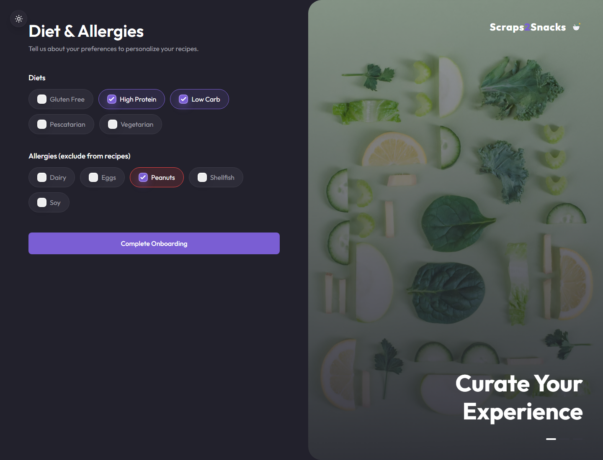

## 8. Pantry

- Route: `/pantry`
- Captured URL: `/pantry?visualRole=user`
- Purpose: Household pantry management and recipe generation workspace.
- Access and routing: Authenticated, subscribed, and onboarded route. Regular users land here after completing setup.

### User Flow

Users add pantry items manually, review existing household ingredients, edit or delete items, select ingredients, and generate AI recipes from selected pantry items.

### Main Screen Areas

  - Hero banner gives page context and displays active diet/allergy badges.
  - Add-item form captures ingredient name, quantity, unit, category, and optional expiration date.
  - Pantry table shows item amount, category, expiration status, and row-level edit/delete actions.
  - Batch actions let users delete selected items or generate a recipe from selected ingredients.

### Detected Page Structure

- Key headings visible in the screenshot: `Household Pantry`
- Visible buttons/actions detected by Playwright: `Add`, `Delete Selected (0)`, `Generate Recipe (0)`
- Inputs and selects detected by Playwright: `E.g., Apples...`, `add-qty`, `add-unit`, `add-category`, `add-expires`, `input`, `input`, `input`, `input`, `input`

### Documentation Notes

This is the core productivity page for reducing food waste. Mock pantry data includes varied expiration dates to show table badges and actions.

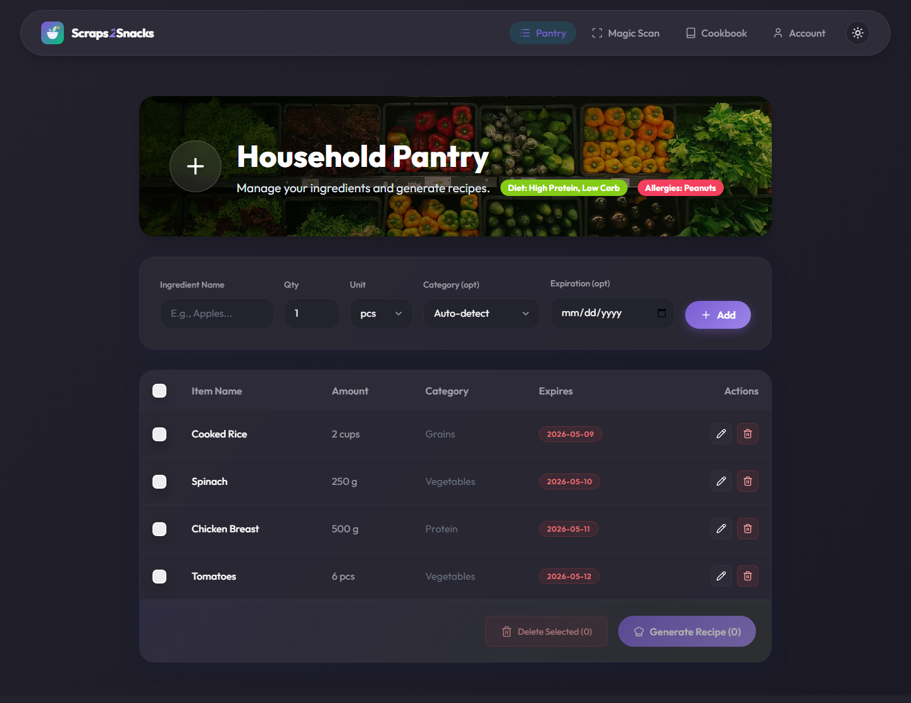

## 9. Magic Scan

- Route: `/scan`
- Captured URL: `/scan?visualRole=user`
- Purpose: Image upload and camera entry point for ingredient scanning.
- Access and routing: Authenticated, subscribed, onboarded route. Requires a household in the real app.

### User Flow

Users upload an image or take a photo. The app sends the image to AI, validates detected food items against preferences, then lets the user confirm items into the pantry.

### Main Screen Areas

  - Hero banner introduces the AI scanning workflow.
  - Upload area supports file upload and device camera capture.
  - Result state can show detected ingredients, confidence, freshness, quantities, units, warnings, and save actions.

### Detected Page Structure

- Key headings visible in the screenshot: `Magic Scan`, `Upload or Capture Ingredients`
- Visible buttons/actions detected by Playwright: `Upload Image`, `Take Photo`
- Inputs and selects detected by Playwright: `input`, `input`

### Documentation Notes

The screenshot captures the idle upload state. Detection results appear after a user chooses an image.

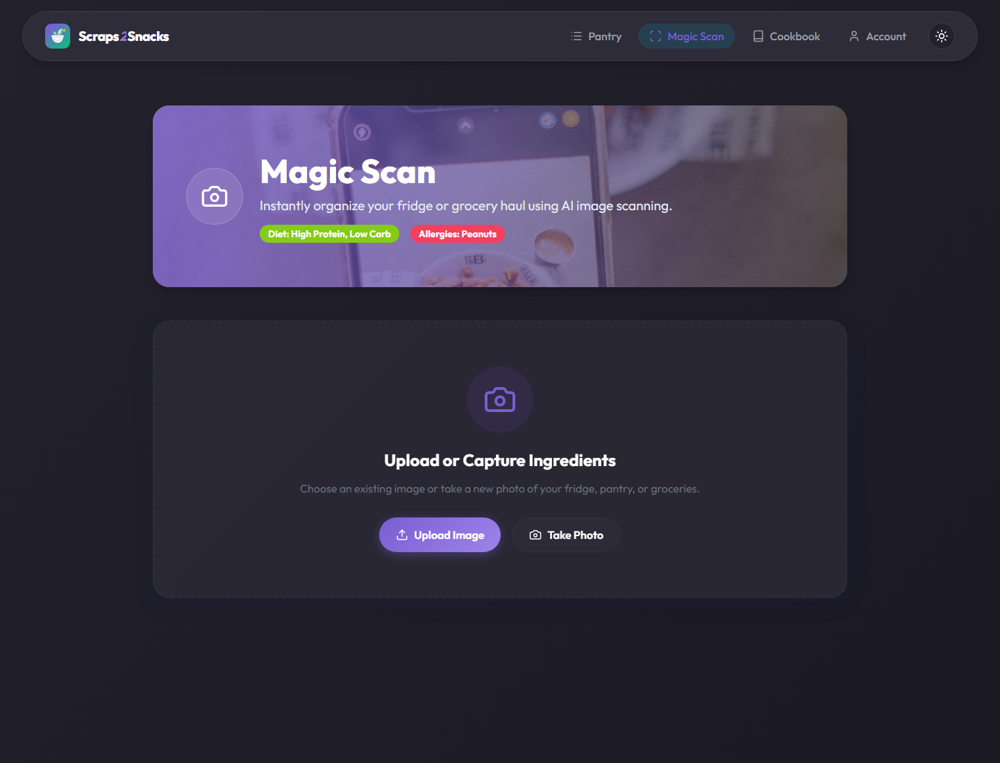

## 10. Cookbook

- Route: `/cookbook`
- Captured URL: `/cookbook?visualRole=user`
- Purpose: Saved AI recipes and cookbook management.
- Access and routing: Authenticated, subscribed, onboarded route.

### User Flow

Users review saved recipes, select recipes for batch deletion, edit recipe title/ingredients/instructions, remove recipes, and use the cookbook chatbot for recipe help.

### Main Screen Areas

  - Hero banner frames the saved recipe library.
  - Recipe cards show saved date, calories when available, ingredients, and instructions.
  - Card actions support edit and delete; toolbar actions support select-all and batch delete.
  - Cookbook chatbot is available as an assistant for saved recipe questions.

### Detected Page Structure

- Key headings visible in the screenshot: `My Cookbook`, `Chicken Pantry Bowl`, `Spinach Tomato Fried Rice`
- Visible buttons/actions detected by Playwright: None detected.
- Inputs and selects detected by Playwright: `input`, `input`, `input`

### Documentation Notes

Mock saved recipes are included so the documentation shows the populated cookbook state instead of the empty state.

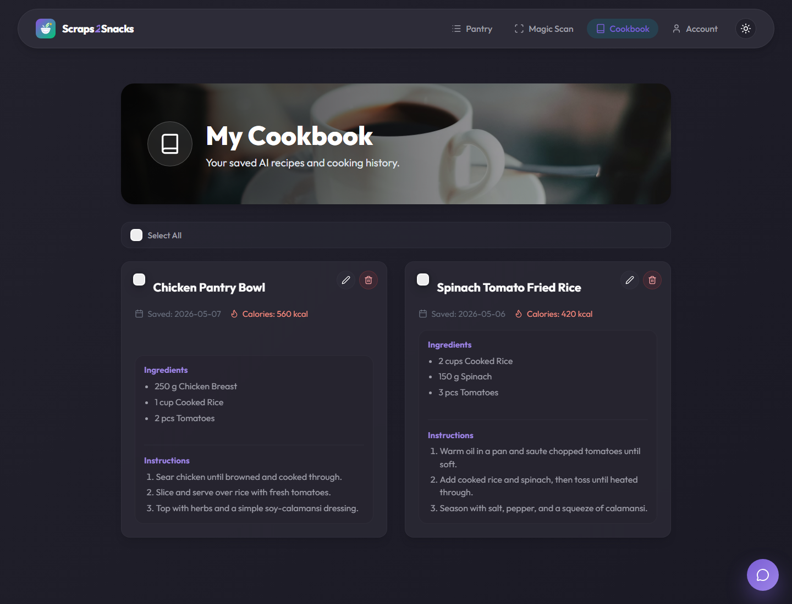

## 11. Account

- Route: `/account`
- Captured URL: `/account?visualRole=user`
- Purpose: Profile, password, subscription, preferences, and sign-out controls.
- Access and routing: Authenticated, subscribed, onboarded route.

### User Flow

Users manage email, password, subscription, diet/allergy preferences, and sign out. Inline edit forms open when email or password rows are selected.

### Main Screen Areas

  - Hero banner identifies the account settings area.
  - Email and password rows open edit forms for credential updates.
  - Subscription row routes to plan management; Diet & Allergies routes to preferences.
  - Sign Out opens a confirmation modal before ending the session.

### Detected Page Structure

- Key headings visible in the screenshot: `My Account`
- Visible buttons/actions detected by Playwright: `Edit`, `Edit`
- Inputs and selects detected by Playwright: None detected.

### Documentation Notes

This page acts as the navigation hub for account-level settings and billing/preferences management.

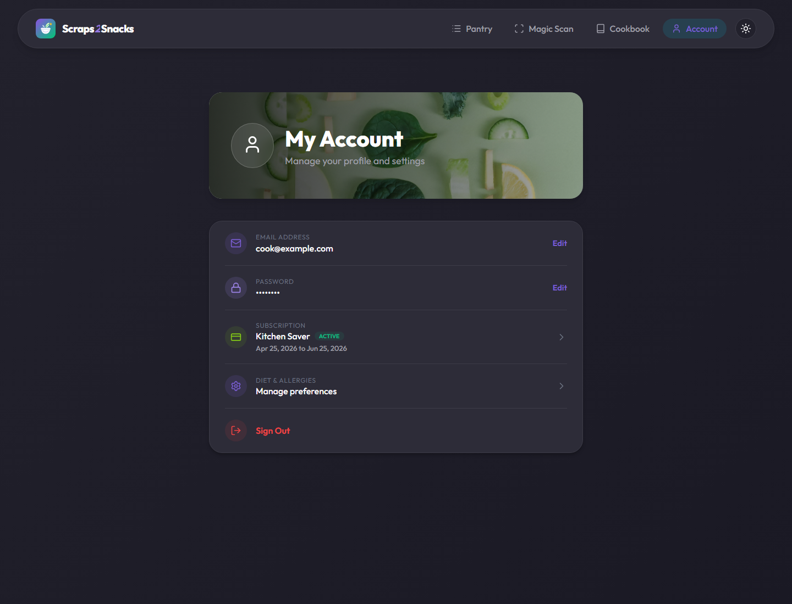

## 12. Admin Dashboard

- Route: `/admin - Dashboard`
- Captured URL: `/admin?visualRole=admin`
- Purpose: Admin landing section for high-level metrics and operational shortcuts.
- Access and routing: Admin-only route. Non-admin users are redirected away from this page.

### User Flow

Admins monitor app metrics, review users and subscriptions, manage plans, inspect pantry records, and maintain recipes from a dedicated dashboard.

### Main Screen Areas

  - Persistent sidebar provides admin section navigation and account controls.
  - Metric cards summarize users, active subscriptions, monthly revenue, and recipes.
  - Dashboard charts show user growth and plan breakdown.
  - Quick actions jump to common admin tasks such as reviewing users, creating plans, and adding pantry or recipe records.

### Detected Page Structure

- Key headings visible in the screenshot: `Dashboard`, `User Growth`, `Subscription Breakdown`, `Recent Users`, `Pantry Alerts`, `Quick Actions`, `Recent Recipes`
- Visible buttons/actions detected by Playwright: `Dashboard`, `Users`, `Plans`, `Pantry`, `Recipes`, `Light Mode`, `Sign Out`, `Refresh`, `Export`, `3 TOTAL USERS 100% +3 in selected period`, `2 ACTIVE SUBSCRIPTIONS 100% 100% of users active`, `₱1,366 MONTHLY REVENUE 100% Kitchen Saver leads plan mix`
- Inputs and selects detected by Playwright: `Dashboard date range`

### Documentation Notes

This is the default admin section shown when an admin opens the /admin route.

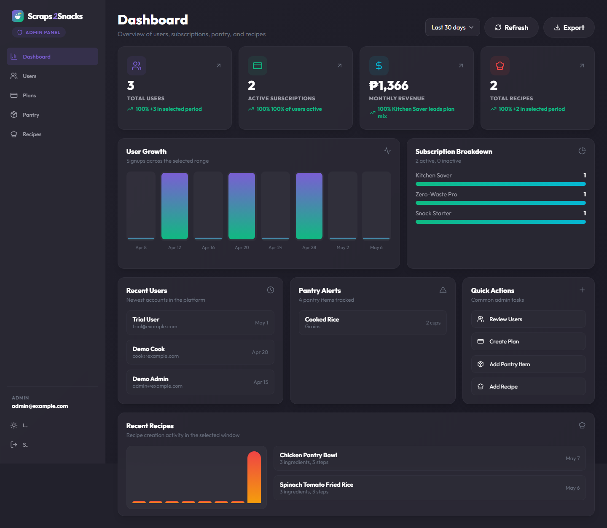

## 13. Admin Users

- Route: `/admin - Users section`
- Captured URL: `/admin?visualRole=admin`
- Purpose: Admin user-management section reached from the Users item in the sidebar.
- Access and routing: Admin-only section inside the /admin route.

### User Flow

Admins review registered users, inspect subscription status, update roles or subscription assignments, and remove user profiles when needed.

### Main Screen Areas

  - Sidebar remains visible so admins can move between dashboard sections.
  - Users table lists account identity, role, subscription status, plan information, and account dates.
  - Row actions expose editing and deletion controls for individual user records.
  - Role and subscription controls help admins correct access or support account issues.

### Detected Page Structure

- Key headings visible in the screenshot: `Users`
- Visible buttons/actions detected by Playwright: `Dashboard`, `Users`, `Plans`, `Pantry`, `Recipes`, `Light Mode`, `Sign Out`, `Clean Auth Mismatches`
- Inputs and selects detected by Playwright: None detected.

### Documentation Notes

This section is not a separate React Router page; it is a sidebar-driven tab inside Admin, so the documentation labels it as an admin section.

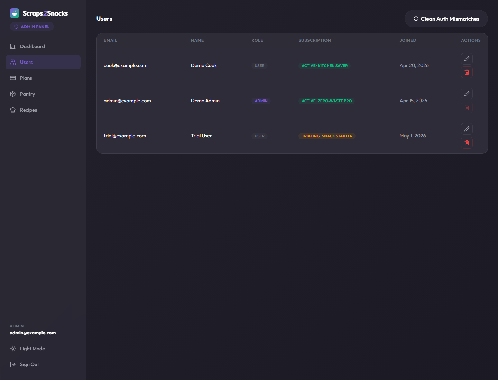

## 14. Admin Plans

- Route: `/admin - Plans section`
- Captured URL: `/admin?visualRole=admin`
- Purpose: Admin plan-management section reached from the Plans item in the sidebar.
- Access and routing: Admin-only section inside the /admin route.

### User Flow

Admins create, edit, activate, deactivate, or delete subscription plans used by registration, checkout, and account billing views.

### Main Screen Areas

  - Plans table shows plan name, code, pricing, billing period, active status, and action controls.
  - Add Plan opens a modal for creating a new subscription plan.
  - Toggle controls let admins turn plans on or off without deleting them.
  - Edit and delete actions support plan maintenance.

### Detected Page Structure

- Key headings visible in the screenshot: `Subscription Plans`
- Visible buttons/actions detected by Playwright: `Dashboard`, `Users`, `Plans`, `Pantry`, `Recipes`, `Light Mode`, `Sign Out`, `Add Plan`
- Inputs and selects detected by Playwright: None detected.

### Documentation Notes

These plan records feed the public registration and subscription pages, so this section is part of the app configuration surface.

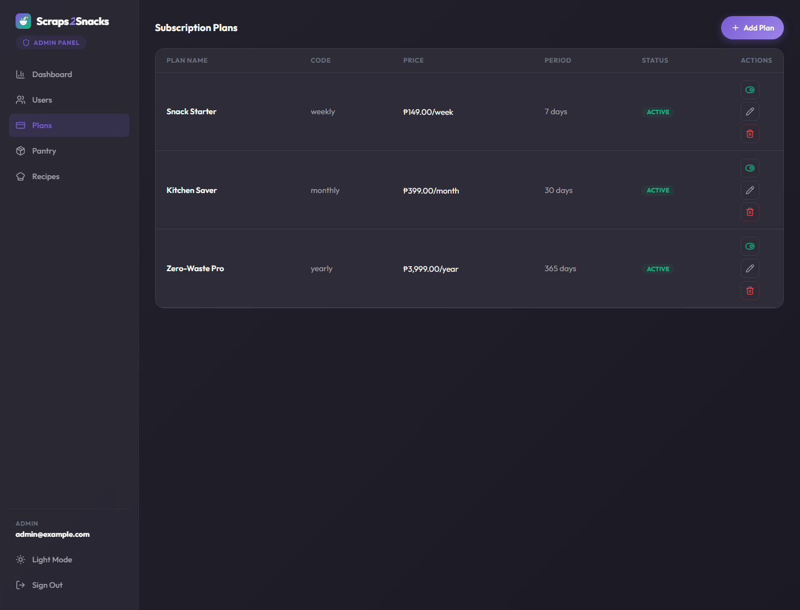

## 15. Admin Pantry

- Route: `/admin - Pantry section`
- Captured URL: `/admin?visualRole=admin`
- Purpose: Admin pantry-inspection section reached from the Pantry item in the sidebar.
- Access and routing: Admin-only section inside the /admin route.

### User Flow

Admins inspect pantry items across households, add items for support/testing, edit item details, and discard records when needed.

### Main Screen Areas

  - Pantry table lists ingredient, category, quantity, expiration, created date, and row actions.
  - Add Item opens an admin form for creating pantry items against a household.
  - Edit actions allow correction of ingredient name, quantity, unit, category, and expiration date.
  - Delete actions mark pantry items as discarded.

### Detected Page Structure

- Key headings visible in the screenshot: `Pantry Items`
- Visible buttons/actions detected by Playwright: `Dashboard`, `Users`, `Plans`, `Pantry`, `Recipes`, `Light Mode`, `Sign Out`, `Add Item`
- Inputs and selects detected by Playwright: None detected.

### Documentation Notes

This admin section supports operational review of household pantry data and is separate from the user-facing Pantry page.

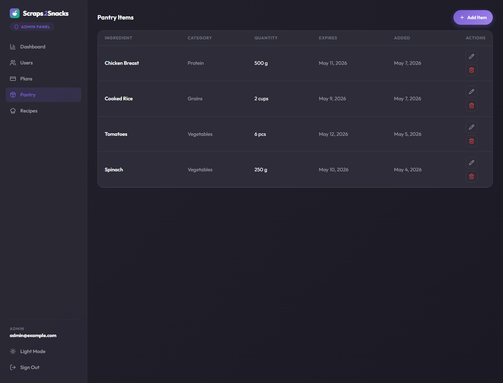

## 16. Admin Recipes

- Route: `/admin - Recipes section`
- Captured URL: `/admin?visualRole=admin`
- Purpose: Admin recipe-maintenance section reached from the Recipes item in the sidebar.
- Access and routing: Admin-only section inside the /admin route.

### User Flow

Admins review generated recipes, add curated recipes, edit ingredients and instructions, and remove recipes from the system.

### Main Screen Areas

  - Recipes table lists title, ingredient/step counts, created date, and row actions.
  - Add Recipe opens a modal for recipe title, ingredient lines, and instructions.
  - Edit actions update an existing recipe’s details.
  - Delete actions remove recipe records and related saved-recipe links.

### Detected Page Structure

- Key headings visible in the screenshot: `Recipes`
- Visible buttons/actions detected by Playwright: `Dashboard`, `Users`, `Plans`, `Pantry`, `Recipes`, `Light Mode`, `Sign Out`, `Add Recipe`
- Inputs and selects detected by Playwright: None detected.

### Documentation Notes

This section documents the final sidebar destination that was missing from the earlier admin capture.

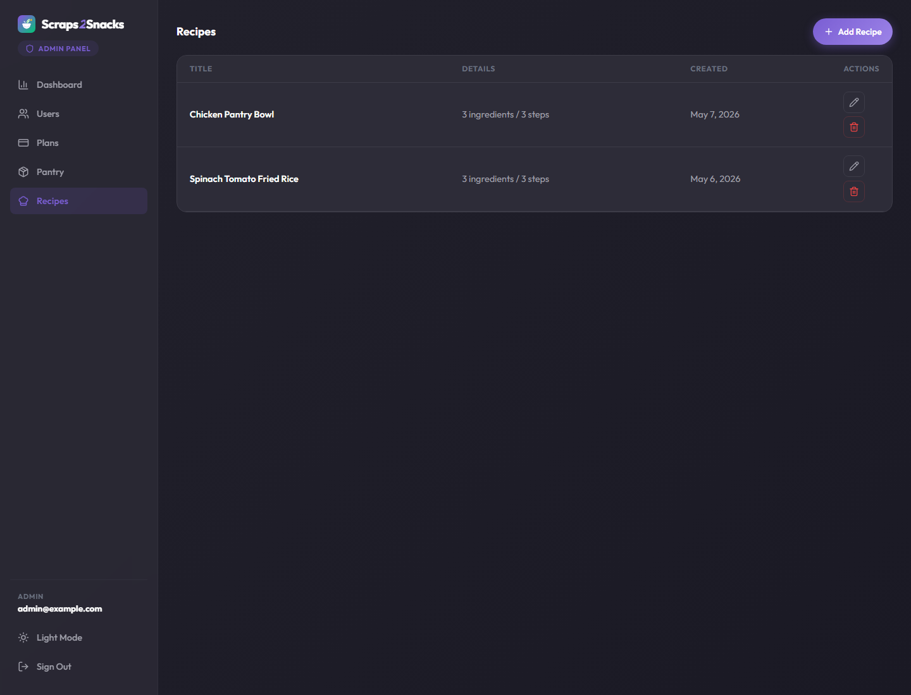

